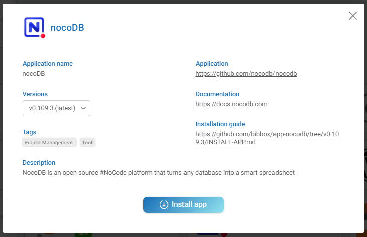
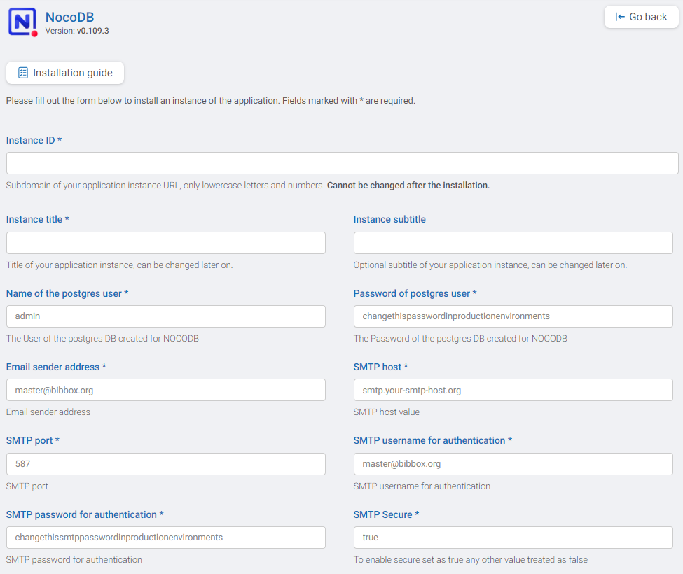

## nocoDB Installation Instructions 

The application can be installed either within the BIBBOX environment or as a stand-alone solution. Installation instructions can be found within the BIBBOX, followed by setup instructions required once the application has been successfully installed.

## Installation within in the BIBBOX

Once you've selected the desired App for your BIBBOX instance, you can choose from the available versions, as shown in the following figure.



Clicking "Install App" will open a new window, as illustrated in the following figure. Here, you can define the necessary entries. Some fields come pre-filled with suggested options, and if left unchanged, these default values will be used as the entries.



After confirming by clicking "Install," the App will be installed as a BIBBOX instance. Once the installation is complete, you only need to follow a few steps to use the App for the first time, which are described below.

## Setup after BIBBOX or stand-alone installation


### First start

The GUI of nocoDB can be accessed at http://nocodbappname.your.bibbox.domain/dashboard/ either **sign-up** or **sign-in** mode. The first user account made will be the Super Admin. Sign-up can be later restricted by the super admin to only invite URLs. 


### e-mail configuration

Configuration of the email parameters can be tricky. if you need to test several configuration you can  edit the docker-compose.yml file and restart the App. Finnaly this worked with mailjet. 

```
      NC_SMTP_FROM: test@bibbox.org
      NC_SMTP_HOST: in-v3.mailjet.com
      NC_SMTP_IGNORE_TLS: 'false'
      NC_SMTP_PASSWORD: ************************************
      NC_SMTP_PORT: 587
      NC_SMTP_SECURE: 'false'
      NC_SMTP_USERNAME: ************************************
```

