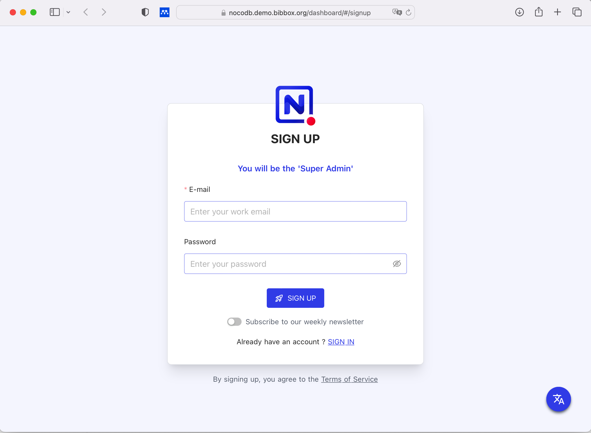

## nocoDB Installation Instructions 

### First start

The GUI of nocoDB can be accesed at http://nocodbappname.your.bibbox.domain/dashboard/ either **sign-up** or **sign-in** mode. The first user account made will be the Super Admin. Sign-up can be later restricted by the super admin to only invite URLs. 



### e-mail configuration

configuration of the email parameters can be tricky. if you need to test several configuration you can just edit the docker-compose.yml file, and restart the App. Finnaly this worked with mailjet. 

```
      NC_SMTP_FROM: test@bibbox.org
      NC_SMTP_HOST: in-v3.mailjet.com
      NC_SMTP_IGNORE_TLS: 'false'
      NC_SMTP_PASSWORD: ************************************
      NC_SMTP_PORT: 587
      NC_SMTP_SECURE: 'false'
      NC_SMTP_USERNAME: ************************************
```

